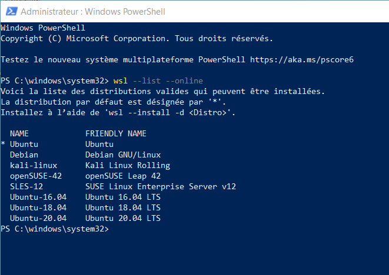
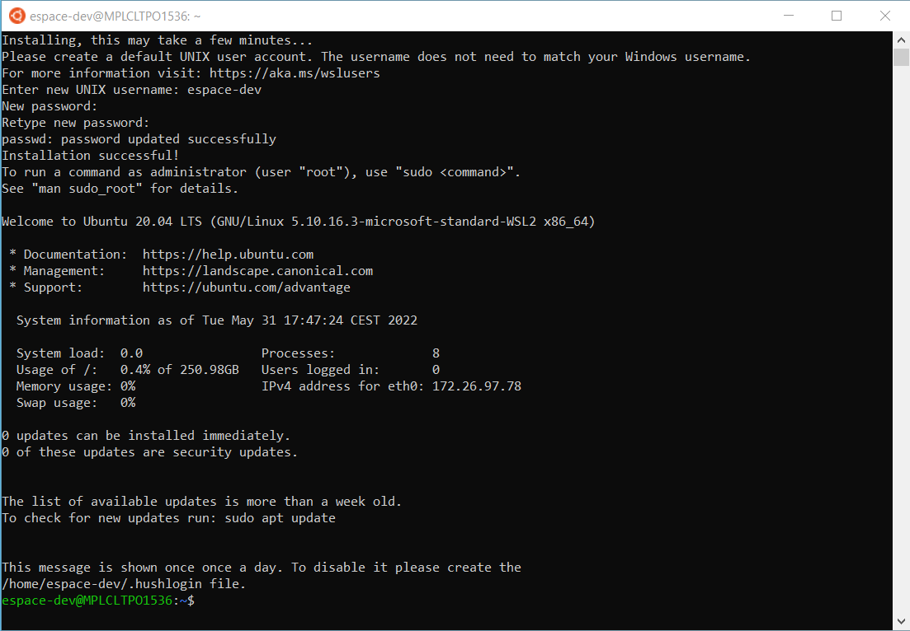

# Installer WSL2 sur Windows 10

## Résumé (pour ceux qui n'ont pas le temps de tout lire).

**WSL** alias **Windows Subsystem for Linux** est une fonctionnalité développée par Microsoft sur Windows 10 et 11 et qui permet d'avoir une console Linux dans Windows.

Quels sont les avantages ?

- facile et rapide à installer (il faut avoir les droits administrateurs)
- on peut choisir la distribution : Ubuntu, Debian, OpenSuse ... on peut même avoir plusieurs distros sur 1 même poste
- très rapide à démarrer (plus rapide qu'une machine sous Virtual Box)
- très facile d'accéder aux fichiers Windows depuis Linux, et vice-versa
- une fois la distribution installée, on peut installer et on met à jour les paquets avec `apt` (sur Debian et Ubuntu)

Pour quoi faire ?

- idéal quand on veut tester un script Python à la fois sur Linux et Windows ! 
- idéal quand on a des scripts shell à exécuter
- WSL s'intégre très bien dans l'IDE **Visual Studio Code** : cela veut dire qu'on peut exécuter des codes sur Linux alors que l'IDE tourne sur Windows

Quels sont les (petits) inconvénients ?

- vous utilisez Linux en mode console : pas d'interface graphique par défaut, donc pas de possibité de visualiser des données (exemple Matplotlib). Il est cependant possible d'installer un **serveur X** pour pallier à ce problème, mais c'est un peu technique sur Windows 10.
- pas de possibilité d'exporter un environnement Linux d'un poste à un autre, WSL n'est pas fait pour cela.

## Page officielle de WSL

<https://docs.microsoft.com/fr-fr/windows/wsl/install>

## Installation d'une distribution Linux avec WSL

Ouvrir **Windows Powershell** en administrateur (choisir **Exécuter en tant qu'administrateur**)

Pour voir la liste des distributions Linux disponibles, tapez :

    wsl --list --online

Pour installer une distribution, tapez :

    wsl --install -d <NAME>

Par exemple pour installer Ubuntu 18.04 LTS, tapez :

    wsl --install -d Ubuntu-18.04

Vous pouvez aussi installer la distribution "par défaut" (Ubuntu) avec :

    wsl --install

Remarque : la distribution par défaut (ligne ci-dessus) est "Ubuntu", mais la version n'est pas explicitée. A la date du 1/6/2022, c'était toujours Ubuntu 20.04 qui était installé sous le nom "Ubuntu".

## Post-installation

**Important :** juste après l'installation, au 1er lancement d'Ubuntu, vous devez définir le login et le mot de passe de l'utilisateur. Notez bien ce mot de passe car il sera demandé pour la commande `sudo`.

Vous venez d'installer Ubuntu : il va se lancer automatiquement.

Définissez le nom et le mot de passe. Exemple : espace-dev / mdp2022

## Lancer Ubuntu

Allez dans le menu Démarrer de Windows et dans la liste des programmes cherchez **Ubuntu**.

## Mettre à jour Ubuntu

Dans la console Ubunutu tapez :

    sudo apt update
    sudo apt upgrade

## Partage de fichier entre Windows 10 et Linux Ubuntu

### Depuis Ubuntu, dans la console

    ls /mnt/c/Users/BernardC/Documents/

### Depuis Windows, dans l'explorateur

Pour voir les fichiers de toutes les distros :

    \\wsl$

Par exemple, accéder à son répertoire `home` ds la distro Ubuntu 20.04 :

    \\wsl$\Ubuntu\home\espace-dev

## Installer le serveur X sur  Windows 10

Installer un serveur X sur Windows 10 permet d'ouvrir et afficher une fenêtre depuis WSL. Exemple : pour exécuter dans Ubuntu un script python qui afficherait un graphique.

Il existe plusieurs logiciels qui permettent cela. Nous avons retenu **VcXsrv** qui est gratuit et disponible à cette adresse : 
<https://sourceforge.net/projects/vcxsrv/>.

Une fois **VcXsrv** installé, il faut configurer la liaison entre Ubuntu d'un côté, et le serveur X sous Windows de l'autre car ils communiquent par IP.

- Lancer **VcXsrv**
- Configurer **VcXsrv** avec ces paramètres : WindowMode="Multiple Window" Display number="0" Clipboard="True" Clipboard Primary="True" Native opengl="True" Disable Access Control="True". Vous pouvez sauvegarder ces paramètres ds un fichier `config.xlaunch` qui servira à lancer rapidement VcXsrv lors des sessions ultérieures.
- Lancer Ubuntu
- Définir la variable d'environnement DISPLAY dans Ubuntu pour configurer l'affichage. Pour tester, vous pouvez installer et lancer `glxgears` (affiche une roue animée en 3D).

    export DISPLAY=$(route.exe print | grep 0.0.0.0 | head -1 | awk '{print $4}'):0.0
    sudo apt install -y mesa-utils
    glxgears

Ceci fonctionne :

<https://stackoverflow.com/questions/61860208/wsl-2-run-graphical-linux-desktop-applications-from-windows-10-bash-shell-erro>

Lire aussi : 

<https://stackoverflow.com/questions/43397162/show-matplotlib-plots-and-other-gui-in-ubuntu-wsl1-wsl2>
<https://stackoverflow.com/questions/61110603/how-to-set-up-working-x11-forwarding-on-wsl2>

## Visual Studio Code

Visual Studio Code ou VSCodium (sa version non-Microsoft <https://vscodium.com/>) doit au préalable être installé sur Windows 10.

Pour lancer l'IDE Visual Studio Code depuis Linux, il faut lancer la commande `code` avec le répertoire qui contient le projet.

Exemple, dans Ubuntu : 

    mkdir -p ~/travail/nouveau
    cd ~/travail/nouveau
    touch README.md
    code .

Vous verrez apparaître en bas à gauche de la fenêtre une étiquette verte : WSL Ubuntu

<https://docs.microsoft.com/en-us/windows/wsl/tutorials/wsl-vscode>

## Désinstaller Ubuntu

Dans PowerShell :

    wsl --unregister <distroName>
